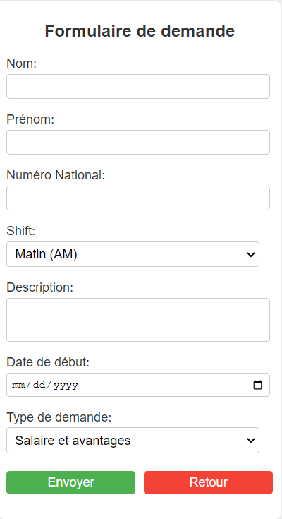

# 1 : Formulaire  demande d'informations : #

## Description : ##

- Le formulaire comprend des champs pour saisir des informations personnelles (nom, prénom, numéro national, shift,).
- Le formulaire comprend des champs pour saisir une description détaillée du problème ou de la question, ainsi que toute information pertinente.
 - la date début de la demande
 - type de la demande
- Un bouton de soumission permet à l'utilisateur de valider et d'envoyer sa demande.
- Un bouton de retour en arrière.

