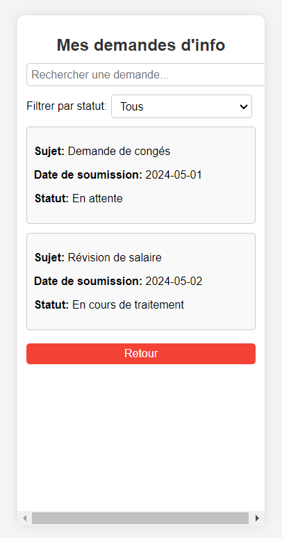

## Mes demandes d'info ###
 

### Description : ###

La section "Mes demandes d'info" permet aux travailleurs de consulter, suivre, et gérer les demandes d'informations qu'ils ont soumises. Cette section offre une interface claire  pour visualiser l'état de chaque demande, recevoir des mises à jour, et interagir avec les représentants syndicaux si nécessaire.
- Fonctionnalités
Tableau de Bord des Demandes :

* Liste des Demandes : Affiche toutes les demandes d'informations soumises par le travailleur, triées par date de soumission.
* Filtres : Permet de filtrer les demandes par statut (en attente, en cours de traitement, traitée) et par date.
* Recherche : Barre de recherche pour trouver rapidement une demande spécifique en utilisant des mots-clés.
* Détails de la Demande :

 Informations de la Demande : Affiche les détails de chaque demande, y compris le sujet, la description, la date de soumission, et le type de demande.
*  Statut Actuel : Indique le statut actuel de la demande (en attente, en cours de traitement, traitée).
* Historique des Actions : Journal des actions effectuées sur la demande, telles que les mises à jour de statut, les réponses des représentants syndicaux, et les clarifications demandées.
Mises à Jour et Notifications :

* Notifications en Temps Réel : Les travailleurs reçoivent des notifications en temps réel lorsqu'il y a des mises à jour sur leurs demandes.
* Messages : Les travailleurs peuvent échanger des messages sécurisés avec les représentants syndicaux pour fournir des clarifications supplémentaires ou poser des questions.
