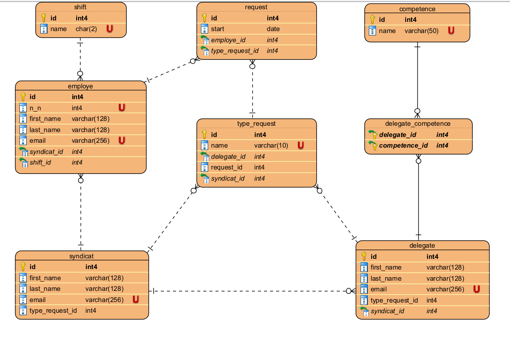

# database #

 Le modèle suivant décrit le schéma de la base de données utilisée pour l'application :

1- La table **employe** contient la liste des employés.

Le délégué est un employé aussi

2- La table **delegate** contient la liste des délégués

La relation entre delegate et type-request :

 - Un délégué peut recevoir et traité plusieurs demandes d'informations.

3- La table **request** contient les demandes d'informations:

La relation request et employe:

- Un employé peut faire plusieurs demandes d'informations.
- chaque demande ne concerne qu'un seul travailleur

4-La table **type-request** contient les différents types de demandes d'informations :

1. Salaire et avantages
2. Bien etre et sécurité au travail
3. Condition de travail
4. Congés et absences
5. Prime syndicale et cotisations

5-La table **syndicat** contient le nom du sécretaire syndicale en lien direct avec les délégués.

La relation entre syndicat et delegate :

- tous les délégué ont un seul secretaire syndicale
- Le secrétaire est en relation avec tous les délégués

la relation entre syndicat et type-request :

-  Un secretaire peut traiter plusieurs demandes d'informations
-  Un secretaire ne peut recevoir qu'un seul type de demande.

La relation entre syndicat et employe :

- Un employe peut etre affilié à un syndicat
- Un syndicat peut avoir plusieurs affiliés (les employes)

6- La table **shift** contient les 3 différents shift qui existe dans l'entrprise : matin(AM) , aprés-midi(PM) et  nuit(N).

La relation entre employe et shift:

- Chaque employe travaille dans un seul shift.

7- La table **compétence** contient les différentes compétences qu'un délégué peut avoir :

- chaque délégué peut avoir une ou plusieurs compétences.

  

