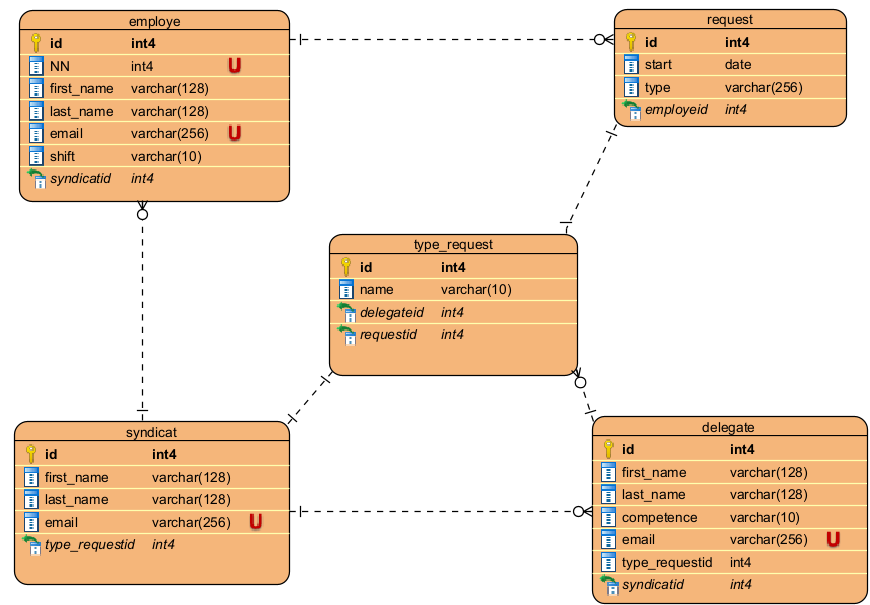

# database #

 Le modèle suivant décrit le schéma de la base de données utilisée pour l'application:

1- la table **employe** contient la liste des employés.

le délégué est un employé aussi.

2- La table **delegate** contient la liste des délégués ainsi que leur compétences.

La relation entre delegate et type-request :

- un délégué peut avoir une ou plusieurs compétences.

- un délégué recoit les types de demande selon ses compétences.
- un délégué peut recevoir plusieurs demandes d'informations.

3- La table **request** contient les demandes d'informations:

La relation request et employe:

-  un employé peut faire plusieurs demandes d'informations.
- une demande ne concerne qu'un seul employe
  

4- la table **type-request** contient les différents types de demandes d'informations:
1. salaire et avantages
2. bien etre et prévention
3. condition de travail
4. congés et absences
5. prime syndicale et cotisations

5- La table **syndicat** contient le nom du sécretaire syndicale en lien direct avec les délégués.

La relation entre syndicat et delegate:

-  chaque délégué à un seul secretaire syndicale
- le secrétaire est en relation avec tous les délégués

la relation entre syndicat et type-request:

-  un secretaire peut traiter plusieurs demandes d'informations
-  un secretaire ne peut recevoir qu'un seul type de demande.

La relation entre syndicat et employe :

- un employe peut avoir qu'un seul syndicat
- un syndicat peut avoir plusieurs affiliés (les employes)

