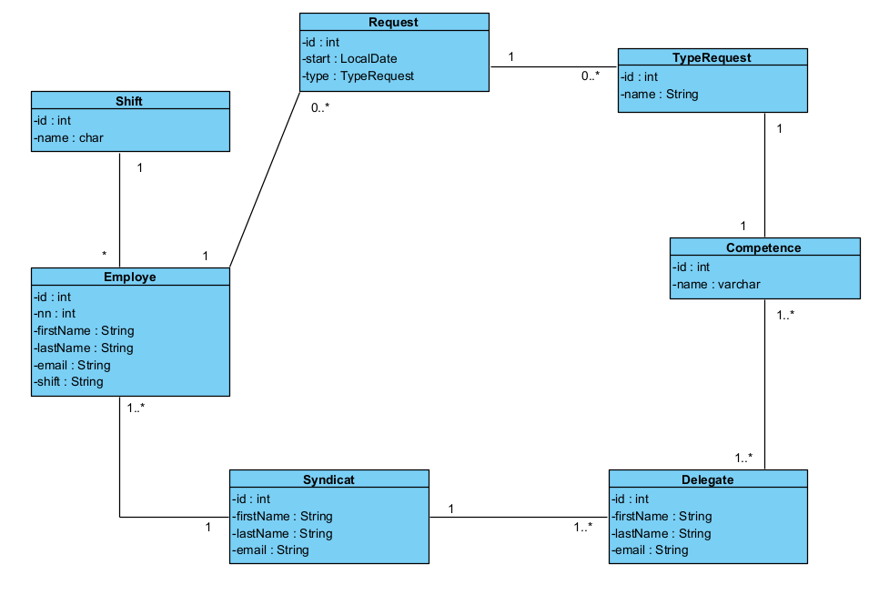

# Entités #

Les entités de la demande d'information sont :

### Employe : ###

La classe employe représente un travailleur, ses attributs sont :

- id :  l'identifiant technique permettant de retrouver l'employé dans la DB.
- nn : le numéro de registre national , il est unique.
- firstName: prénom
- lastName : nom de famille
- email : il doit être unique
- shift : le travailleur fait parti d'une seule équipe qui peut être modifiée

### Shift ###

la classe shift représente les différents shift au sein de l'entrprise, ses attributs sont : 

- id : l'identifiant technique permettant de retrouver le type de shift 
- name : le nom du shift : matin (AM), aprés-midi (PM) ou nuit (N)

### Request : ###

La classe request représente une demande d'information :

-  id : est l'identifiant en base de données
- start : est la date de début de l'envoi de la demande d'information, start doit être aujourd'hui ou dans le futur
- type : est une réference au type de demande d'information

### Type_request : ###

La classe type_request représente un type de demande d'information  : 
-  id : est l'identifiant en base de données
- name : est le nom du type de demande, il doit être unique

### Delegate : ###

La classe delegate représente la délégation syndicale : 

-  id : est l'identifiant en base de données
- firstName: prénom
- lastName : nom de famille
- email : il doit être unique
- compétence : les différentes compétences d'un délégué

### Competence ###

La classe compétence représente les différentes compétence qu'un délégué pourra avoir.

- id : l'identifiant en base de données 
- name : le nom du type de compétence , il y en 5.

### Syndicat : ###

La classe syndicat représente l'organisation syndicale :

- id : est l'identifiant en base de données
- firstName: prénom du secrétaire syndical
- lastName : nom de famille du secrétaire syndical
- email : il doit être unique
