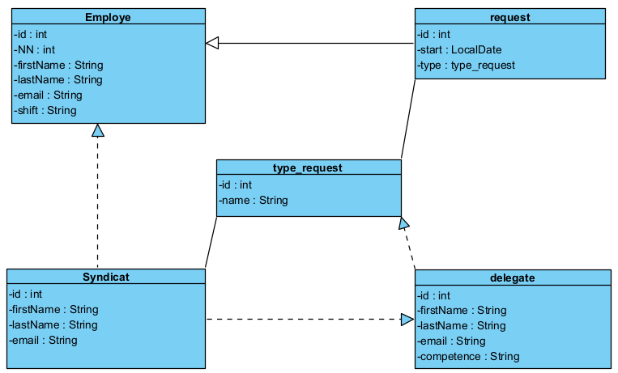

# Entités #

Les entités de la demande d'information sont :

### Employe : ###
la classe employe représente un travailleur,ses attributs sont :
- id :  l'identifiant technique permettant de retrouver l'employé dans la DB.
- NN : le numéro de registre national , il est unique.
- firstName: prénom
- lastName : nom de famille
- email : il doit être unique
- shift : le travailleur fait parti d'une seul équipe qui peut etre modifier

### Request : ###
La classe request représente une demande d'information :
-  id : est l'identifiant en base de données
- start : est la date de début de l'envoi de la demande d'information, start doit être aujourd'hui ou dans le futur
- type : est une réference au type de demande d'information

### Type_request : ###
La classe type_request représente un type de demande d'information : 
-  id : est l'identifiant en base de données
- name : est le nom du type de demande, il doit etre unique

### Delegate : ###
La classe delegate représente la délégation syndicale : 
-  id : est l'identifiant en base de données
- firstName: prénom
- lastName : nom de famille
- email : il doit être unique
- compétence : les différentes competences d'un délégué

### syndicat : ###
La classe syndicat représente l'organisation syndicale :
- id : est l'identifiant en base de données
- firstName: prénom du secrétaire syndicale
- lastName : nom de famille du secrétaire syndicale
- email : il doit être unique
